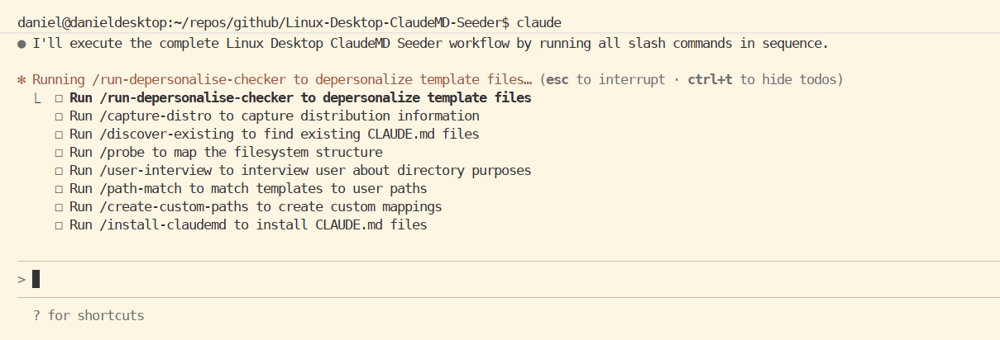

# Linux Desktop ClaudeMD Seeder



A systematic utility for spawning contextual CLAUDE.md files across your Linux desktop filesystem to enhance Claude Code's understanding of your directory structure and workflows.

## Overview

[Claude Code](https://claude.com/claude-code) uses CLAUDE.md files for folder-level context. This tool automates the process of creating these context files at strategic locations throughout your filesystem, making Claude Code more effective for both traditional development and system administration tasks.

### Why Use This?

- **Systematic Context**: Automatically create CLAUDE.md files at key filesystem locations
- **Prevent Overwrites**: Discovers and preserves existing CLAUDE.md files
- **Customizable**: Templates adapt to your specific directory structure and purposes
- **Repeatable**: Run multiple times to update or extend your context files

## Quick Start

### 1. Clone and Setup

```bash
git clone https://github.com/[username]/Linux-Desktop-ClaudeMD-Seeder.git
cd Linux-Desktop-ClaudeMD-Seeder
./setup.sh
```

The setup script will:
- Create the data storage structure for your filesystem context
- Install slash commands to `.claude/commands/` for use in Claude Code

### 2. Run the Workflow

In Claude Code, execute the slash commands in sequence:

```
/run-slashes
```

Or run them individually in this order:
1. `/run-depersonalise-checker` - Adapt templates to your name/preferences
2. `/capture-distro` - Capture your Linux distribution info
3. `/discover-existing` - Find and record existing CLAUDE.md files
4. `/probe` - Map your filesystem structure
5. `/user-interview` - Answer questions about directory purposes
6. `/path-match` - Match templates to your filesystem
7. `/create-custom-paths` - Create custom mappings for unique directories
8. `/install-claudemd` - Install CLAUDE.md files (skips discovered locations)

## Repository Structure

```
.
├── setup.sh                           # Main setup script (run this first)
├── scripts/
│   ├── sync-context.sh                # Syncs context model to data directory
│   ├── sync-slash-commands.sh         # Syncs slash commands from .claude/commands
│   ├── find-non-repo-claude-files.sh  # Discovery script for existing CLAUDE.md files
│   └── install-slash-commands.sh      # Installs slash commands to .claude/commands
├── slash-commands/                    # Workflow slash commands
│   ├── run-depersonalise-checker.md
│   ├── capture-distro.md
│   ├── discover-existing.md
│   ├── probe.md
│   ├── user-interview.md
│   ├── path-match.md
│   ├── create-custom-paths.md
│   ├── install-claudemd.md
│   └── run-slashes.md
├── templates/                         # Pre-written CLAUDE.md templates
│   ├── repo-base-levels/
│   ├── system-directories/
│   └── user-directories/
├── context-model/                     # Schema/templates for data storage (git-tracked)
├── data/                              # User-specific context data (git-ignored)
│   ├── captured-context/
│   │   ├── distro.json
│   │   ├── discovered-claudemd.json
│   │   ├── osmap.json
│   │   ├── user-interview.json
│   │   └── fs-probes/
│   └── slash-execution-order.json
└── .claude/                           # Project-level Claude Code configuration
    └── commands/                      # Installed slash commands (copied by setup)
```

## Key Concepts

### Context Model vs. Data

- **`context-model/`**: Git-tracked schema and templates defining data structure
- **`data/`**: Git-ignored user-specific data that accumulates during use
- The `sync-context.sh` script syncs from context-model to data non-destructively

### Discovery and Skip List

The `/discover-existing` slash command scans your filesystem for existing CLAUDE.md files outside repository bases and records them in `data/captured-context/discovered-claudemd.json`. These locations are automatically skipped during installation to preserve your customized context files.

### Templates

Templates in the `templates/` directory provide pre-written CLAUDE.md content for common directory purposes:
- Repository bases (GitHub, GitLab, Hugging Face)
- Configuration directories
- Scripts directories
- And more...

During the workflow, Claude will match these templates to your actual filesystem paths and customize them based on your distribution and preferences.

## Workflow Details

### Phase 1: Discovery (Steps 1-4)
1. **Depersonalization**: Adapts repository author's references to your name
2. **Distribution Capture**: Records your Linux distro, DE, display server
3. **Existing File Discovery**: Finds and records existing CLAUDE.md files
4. **Filesystem Probing**: Maps your directory structure

### Phase 2: Mapping (Steps 5-7)
5. **User Interview**: Claude asks about directory purposes
6. **Template Matching**: Matches templates to your paths
7. **Custom Paths**: Creates mappings for unique directories

### Phase 3: Installation (Step 8)
8. **CLAUDE.md Installation**: Deploys files while respecting skip list

## Customization

After installation, you're encouraged to:
- Edit the generated CLAUDE.md files to reflect your specific use cases
- Add notes to `discovered-claudemd.json` about why certain files exist
- Modify templates in `templates/` before running the workflow
- Re-run individual slash commands to update specific aspects

## Data Storage

All captured context is stored in `data/captured-context/`:

| File | Purpose |
|------|---------|
| `distro.json` | Linux distribution, DE, display server info |
| `discovered-claudemd.json` | Existing CLAUDE.md files to preserve |
| `osmap.json` | Mapping from templates to your filesystem paths |
| `user-interview.json` | Your responses about directory purposes |
| `user-paths.json` | Additional user-specific paths |
| `fs-probes/` | Raw filesystem probe data |

## Maintenance

### Updating Templates

If the repository maintainer updates templates or schemas:

```bash
git pull
./setup.sh
```

The `sync-context.sh` script updates your data directory non-destructively, preserving your captured context.

### Re-running the Workflow

You can re-run the workflow at any time:
- Initial runs: Comprehensive discovery and installation
- Later runs: Incremental updates, respecting existing files

## Contributing

Contributions welcome! Consider:
- Adding new templates for common directory types
- Improving slash command workflows
- Enhancing the discovery script
- Documenting edge cases

## License

MIT

## Credits

Created to enhance Claude Code's contextual understanding of Linux desktop environments and workflows.
